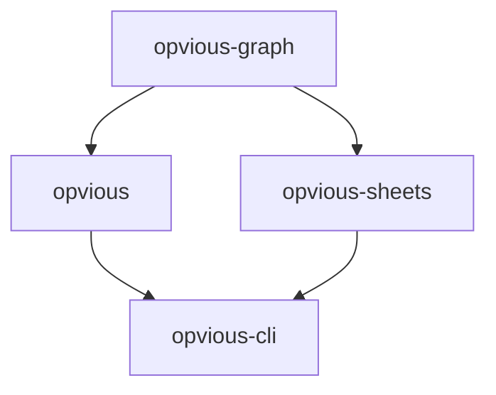

# Overview

## Libraries

+ [`opvious`](modules/opvious.html), main SDK. Start here if you are not sure
  which package to use.
+ [`opvious-graph`](modules/opvious_graph.html), lower-level GraphQL SDK. Use
  this if you want to use the underlying GraphQL types in an environment with
  strict dependency requirements (e.g. Google Apps Script).
+ [`opvious-sheets`](modules/opvious_cli.html), spreadsheet utilities.

## Dependency graph

